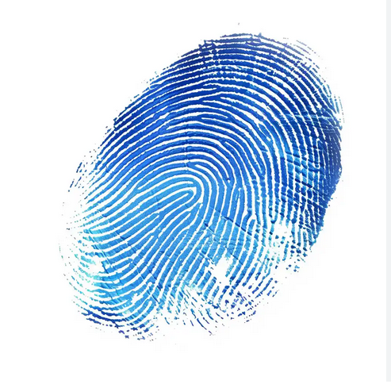

<p align="center">
    
</p>
<p align="center">
    <a href="https://opensource.org/license/bsd-3-clause">
        
    </a>  
    <p align="center">An alternative r307 Fingerprint library for Arduino</p>
</p>


## Yet another Fingerprint Library?

In 2024, I decided to make my own fingerprint sensor library out of frustration due to working with the poorly documented Adafruit Fingerprint Library while working on a cashless transaction module at the 
time. 
Later, I decided to revisit the idea to create it in a re-usable manner allowing it to be used in many applications.

I made the decision to write this library in "C-like C++", specifically a blend between C99 and C89 code. 

Since C is cross compatible with virtually any language, and this library exposes the basic fucntionality for working with this sensor, you can,
for example, write a smart door system that uses a database interface with a Python ORM to query fingerprints using a custom API that uses this library to read / write fingerprint templates / character files / bitmap images to the fingerprint sensor.

I also made the decision to use only the SoftwareSerial library for UART communication. This was done for 2 reasons:

* To ensure that the HardwareSerial ports(0 and 1) are reserved for debugging.
* To ensure cross compatibility as all microcontollers supporting SoftwareSerial can carry out UART communication with the sensor using any port.


## Features

Here is a list of the current features:

* A container for the system parameter values.
* Debugging information conveyed to the terminal.
* Verifying the module password.
* Changing the module password.
* Reading compressed images from the Image Buffer.
* Reading templates from the Character Buffer.
* Writing templates to the Character Buffer.
* Reading templates to from the Notepad.
* Writing templates to the Notepad.
* Reading system parameter values.
* Modifying system parameter values.
* Random Number Generation.
* Comparing two templates
* Searching for a template
* Getting template ID's


### Dependencies

In order to use the library you will need:

* Arduino IDE
* SoftwareSerial library


## Implementation details

### Specification Details

Below is how an image is converted into a template and some of the r307 sensor's specs. 

* The fingerprint sensor captures a fingerprint, called an image, from the user. This image is a bitmap image that is 73,728 bytes big.
* The bitmap image is placed in the image buffer which is an array in the sensor's RAM. Here, it can be compressed into a character file of size 256 bytes.
* A character buffer in the sensor's RAM can be used to store character files or template files. There are two character buffers, each of size 512 bytes.
* Character files can be joined together to make a template file, of size 512 bytes, which is the final "version" of an image. This can be stored in the non-volatile flash memory.
* The non-volatile flash memory can hold up to 1000 templates.

Visit the manuals in the "manuals" directory for more information on the r307 specs.

### Communication Details

Stuff sent to or from the sensor is in form of a packet. Fundametally, all that the functions do is sending and receiving packets.

* When the desired function is called, it sends a packet called a Command packet. Command packets contain a unique command telling the sensor to caryy out a specific action.
* Afterword, the sensor sends a packet, called an Acknowledge packet. These contain a confirmation code and most contain some extra data which may be expected by the user.
* In some cases the sensor may send or even receive a second packet only containing data, called a Data packet. This is most evident in functions like.
* Another kind of packet, called an End packet can be sent in the event that multiple data packets are sent to the sensor. This packet helps to tell the sensor that the data it contains is the last batch / chunck of some big piece of data like a raw image.

  Also, all packets are sent and received via the UART communication protocol. The contents of any packet can only be sent 1 byte at a time for both the upper comuter(like an Arduino) and the sensor.

### ultraFinger Functions

```C
extern void setBaud()
```    
Sets the baud rate of the upper computer

```C
extern void passwordVerify(uint8_t password[4])
```
Verifies the sensor's handshaking password
    
```C
extern void passwordSet(uint8_t new_password[4])
```
Changes / Sets the sensor's handshaking password 

```C
extern void systemBasicParameterSet(uint8_t parameter_number, uint8_t new_parameter)
```
Changes either the baud rate, security level or packet length (Basic System Parameters) 

```C
extern Fingerprint_Helper_t systemParameterRead()
```
Reads the the current system parameter values     
        
```C
extern void setModuleAddress(uint8_t new_address[4])
```
Sets the device address value 

```C
extern void controlUARTPort(uint8_t port_state)
```
Turns the UART port on the sensor on / off 

```C
extern void fingerprintVerify(uint8_t capture_time, uint16_t start_bit_number, uint16_t search_quantity, uint16_t(*result)[2])
```
Matches captured fingerprint with fingerprint library and returns the result 

```C
extern void fingerprintAutoVerify(uint16_t(*result)[2])
```
Collects fingerprint, matches it with the fingerprint library and returns the result     

```C
extern void imageReceive(uint8_t* output_image, uint16_t* image_size)
```
Receives an image from the image buffer, puts its address in output_image and its the address to a variable stored in image_size whose value will be size (uploads an image) 

```C
extern void imageToCharFile(uint8_t buff_number) 
```
Generates character file from the original finger image in the image buffer and stores it in either character buffer 1 or 2 
        
```C
extern void characterFileReceive(uint8_t buff_number, uint16_t* data_size, uint8_t* result)
```    
Receives a character file or template from the specified character buffer (uploads a character file) 

```C
extern void characterFileSend(uint8_t buff_number, uint16_t* data_size, uint8_t* result)
```    
Send character file or template to the specified character buffer (downloads a character file) 

```C
extern uint16_t templateNumberRead()   
```
 Reads a valid template number 

```C
extern void templateGenerate()
```    
Generates a template from character files in the character buffers 

```C
extern void templateStore(uint8_t buffer_number, uint16_t pageID)
```    
Stores the template of the specified character buffer in the designated location of the flash library 

```C
extern void templateRead(uint8_t buff_number, uint16_t pageID)
```    
Loads / Reads a template at the specified location (pageID) of the flash library and places it in either character buffer 1 or 2 

```C
extern void templateDelete(uint8_t pageID, uint16_t n_templates)
```   
Deletes n number of templates of the flash library starting from the specified location (pageID)  

```C
extern void templateMatch()
``` 
Carries out precise matching of templates, one in character buffer 1 and the other in character buffer 2    

```C
extern void fingerLibraryEmpty()
```    
Deletes all templates in the finger library (aka flash library) 

```C
extern void fingerLibrarySearch(uint8_t buffer_number, uint16_t start_address, uint16_t page_num)
```    
Searches the whole finger library (aka flash library) for the template that matches the one in the specified character buffer 

```C
extern void notepadWrite(uint8_t page_num, uint8_t(*data)[32])
```   
Writes data to the specified flash page  

```C
extern void notepadRead(uint8_t page_num, uint8_t(*return_data)[32])
```   
Reads the specified flash page's content  
        
```C
extern uint32_t generateRandomCode()
```
Generates a random number from the sensor and return it to the computer 


## Conclusion


This library aims to provide a robust and flexible solution for working with fingerprint sensors in various applications. Whether you're building a cashless transaction system, a smart door lock, or any other project requiring fingerprint authentication, UltraFinger is designed to meet your needs.


Feel free to contribute, report issues, or suggest features!
